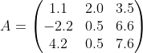

# High performance libraries

While scientific computing programs solve or simulate a huge
number of different problems, many of them need to perform similar
subtasks of e.g. numerical mathematics, such as solving systems of
linear equations and eigenvalue problems or performing various matrix
operations, fast Fourier transforms and so on. To make the software
developer's task easier, the most common algorithms and operations are
available in performance-optimized subroutine libraries that can be
*linked* to the main program.

In addition to providing convenient tools for common tasks, the
libraries can typically provide greatly improved performance over
naïve algorithms. Getting everything out of the CPU can require
tedious optimizations, which can mean, in many cases, different
approaches depending on the underlying hardware. By utilizing high
performance libraries, performance portably is also improved.

## Example: matrix operations

Most of us have solved in school simple systems of linear equations,
such as
$$
 1.1 x + 2.0 y + 3.5 z = 0.5
-2.2 x + 0.5 y + 6.6 z = 0.6
 4.2 x + 0.5 y - 7.6 z = 0.7
$$
and as you might remember, solving system of three equations (with
three variables $$x$$, $$y$$, and $$z$$) by pen and paper can already
be a bit tedious. In scientific problems one encounters often systems
with tens of thousands of equations and variables.

The linear equation can be written in a *matrix* form as
$$
A x = b
$$
where $$A$$ is a matrix.

In this notation all the unknowns are gathered to a vector $$x = (x, y,
z)$$, and all the right hand sides to a vector $$b = (0.5, 0.6,
0.7)$$.

When working with matrices, one of the most common operations is a
matrix-matrix product. In matrix-matrix product $$C = A \times B$$,
each element of $$C$$ is obtained by summing the products of columns
in $$A$$ and rows in $$B$$:


The mathematical formulation of a matrix–matrix
product is:
$$
C_{ij} = \sum_k A_{ik} B_{kj}.
$$

where the $$\sum_k$$ notation means that one sums over the columns of
A and rows of B.

In principle matrix-matrix product is very straigthforward to program,
for example, in Fortran, the code would be:
```fortran
...
integer, parameter :: M=100, N=200
real :: A(M, N), B(N, M), C(M, M)
integer :: i, j, k

! Initialize A and B
...
do i=1, M
  do j=1, M
    do k=1, N
      C(i, j) = C(i, j) + A(i, k) * B(k, j)
    end do
  end do
end do
...
```
However, this naïve algorithm is very inefficient. By using an optimized
high performance library, the matrix multiplication can in many cases be
over 100 times faster.
