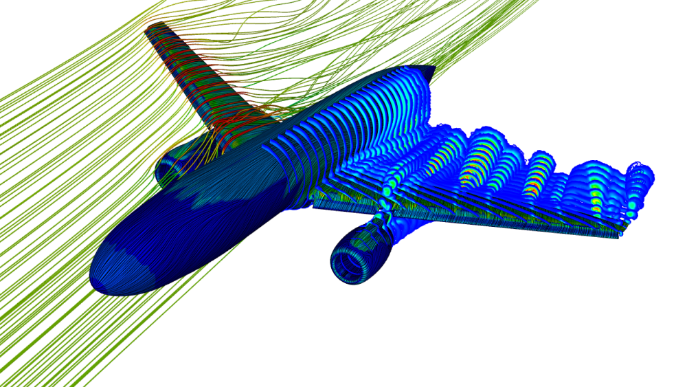

# What are supercomputers used for ?
HPC has been the foundation for cademic research, innovation, and societal advancements for a long time. The main benfits of HPC: reduce physical testing, faster results, reduced costs, innovation. Below are some examples in which HPC is critical.

### Materials Science
* new materials
* design of meta-materials
* industrial processes

### Engineering & Industry
* oil and gas: finding new reservoirs, fluid flow and seismic processing
* aerospace: flow of air over the wings
* financial technology: risk analysises, high-frquency trading, financial modeling, fraud detection
* cybersecurity
* constuction

### Life Sciences
* genomics, bioinformatics: analysing drug interactionssequencing DNA, predicting protein folding
* healthcare: medical imaging and diagnozing, researching drugs and vaccines, living heart project, cancer treatment

### Earth Sciences 
* long term climate modeling
* weather prediction

### Machine learning
* deep learning
* analysis of data from high throuput experiments
* prediction of material properties
* retail (targeted product recommendations)

## Media and etertainment
* creating animations, sepcial effects for movies, transcoding media files

