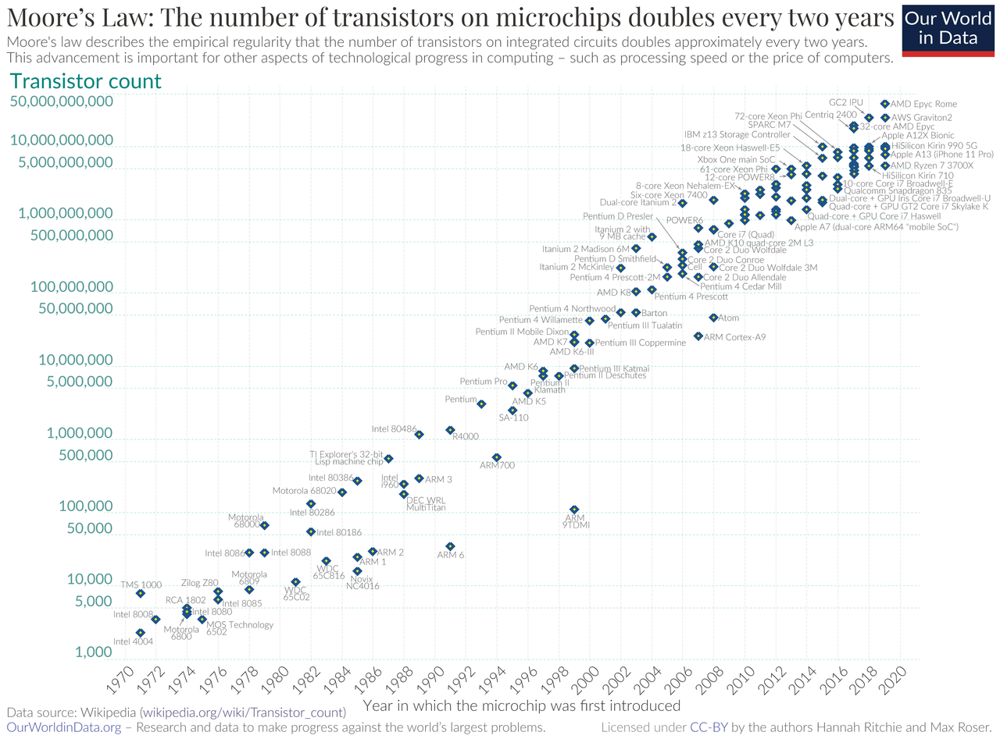

# Moore's Law

* every 2 years the density of the transitors doubles.

 

## Consequences
Miniaturization has a direct Dennard scaling, also known as MOSFET scaling, is a scaling law which states roughly that as transistors get smaller, their power density stays constant, so that the power use stays in proportion with area; both voltage and current scale (downward) with length.
* smaller transitors require less voltage and current ([Dennard scaling](https://en.wikipedia.org/wiki/Dennard_scaling))
* smaller voltage implies higher clock rates
* higher clocker rate resulted in sinlge processor performance doubling every 18 months

 
## End of the law?
* more cores, still doubling (at the monent!) the density of the transitors
* clock rate reached the physical limitations
* single precision saturated, but total performance still doubling
* reaching the physical limit of miniaturization 
