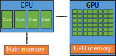

<!-- Includes material from "Supercomputing" online-course (https://www.futurelearn.com/courses/supercomputing/)
by Edinburgh Supercomputing Center (EPCC), licensed under Creative Commons SA-BY -->

# Graphics processing units

Supercomputers are largely built out of general-purpose components, which
until recently meant using multicore CPUs because commercial demand was mainly
driving the development of these processors for desktop and business
computing. However, there is another market where processor performance is
important: computer gaming.

Computer games are such an enormous market that it is worthwhile developing
special processors, Graphics Processing Units or GPUs, to produce high quality
3D graphics. Special video processors were used already in 1970s, but the
modern GPU can be said to be born in 1990s. Sony introduced the term graphics
processing unit in 1994 in the Sony Playstation, and during the end of the
decade GPUs started to appear in the PC world. In the early 2000's started the
first experiments in using GPUs for scientific computing, and as some GPUs
started to include features targeting also high-performance computing, the
term GPGPU (General Purpose Graphics Processing Unit) was coined. Today one
uses mostly only the term GPU also in high-performance computing.

When comparing a CPU to a GPU one word can describe the differences:
**complexity**. Below is a schematic representation of a CPU and a GPU side
by side.

<!-- Image source https://docs.nvidia.com/cuda/cuda-c-programming-guide/ 
     copyright  NVIDIA Corporation -->

A CPU is a more complex, flexible device oriented towards general purpose
usage. It's fast and versatile, designed to run operating systems and various,
very different types applications. It has lots of features, such as better
control logic, caches and cache coherence, that are not related to pure
computing.

A GPU has in comparison a relatively small amount of transistors dedicated to
control and caching, and a much larger fraction of transistors dedicated to
the mathematical operations. Since the cores in a GPU are designed just for 3D
graphics, they can be made much simpler and there can be a very larger number
of cores. The current GPUs contain thousands of cores. An individual core in
a GPU is less powerful than one in a CPU, but via the high amount of
parallelism available in a GPU, it can outperform a multicore CPU. GPUs have
typically also much higher memory access speed than CPUs, which can also be
important for good performance. Due to the simpler construction, GPUs are
also more energy efficient than CPUs, which is to say they use less energy per
floating point operation. For this reason most of the new systems targeting
exascale performance utilize GPUs. Otherwise, the electricity consumption when
running these systems would become prohibitive.

Because of the simpler operation of GPU cores and the requirement for large
amount of parallelism, all scientific problems cannot be adapted easily to
GPUs. While CPUs can handle efficiently also task level parallelization where
different cores perform different operations, GPUs work efficiently only in a
highly data parallel cases, where all the cores perform identical arithmetic
operations for different data. Generally, programming GPUs is more involved
and extracting good performance might require the programmer to take into
account some quite low level details about the hardware.

Due to their specialized nature, GPUs need CPUs on their side. GPUs do not run
any operating system, and the application execution starts always in the CPU.
After the application starts, computations can be *offloaded* to the GPU for
speed up. Accordingly, GPUs are often referred to as accelerators. Depending
on the particular case, only a part of the application may be offloaded to the
GPUs or all the computationally intensive parts. It is also possible to
perform computations both on the CPU and the GPU at the same time. The main
memories of the CPU and and the GPU are separate, so in order to carry out
computations data needs to be first copied from the CPU to the GPU. Also, when
the CPU needs to operate with the results of the GPU, data needs to be copied
from the GPU to the CPU. As mentioned, the memory bus between the GPU main
memory and the GPU cores is typically faster than in CPU, but moving the data
between the CPU and GPU is relatively slow and can often become a performance
bottleneck. The programmer must pay careful attention to minimize data
transfers between the CPU and the GPUs.

Despite the challenges and limitations, many applications benefit from GPU
acceleration. In supercomputers, there are typically 4-6 GPUs and 1-2 CPUs per
node. When comparing the performance of an application when running with the
GPUs or only with the CPUs, GPUs can typically speed up the application by a
factor of 4-8, but in some cases even by a factor of ten or more.

GPUs play a particularly important role in machine learning applications, like
training neural networks. The arithmetic operations in the training of neural
networks are inherently highly parallel and as such are very well suited for
GPUs, and in best cases GPUs are up to 30 times faster than CPUs.

Even though the GPUs have had major role in high-performance computing for
only a bit over ten years, using accelerators in supercomputers is nothing new.
Utilizing some type of co-processors to carry out part of the calculations has
been an on and off going trend since 1960s. At the moment it looks like GPUs
(or other types of accelerators) are here to say, but only time will tell.

Nvidia has traditionally been the most visible GPU vendor, both due to the
performance of their hardware as well as due to the maturity of theri software
development ecosystem. Recently also Intel and AMD have been active in
designing GPUs for high-performance computing. The LUMI supercomputer will use
AMD GPUs.
