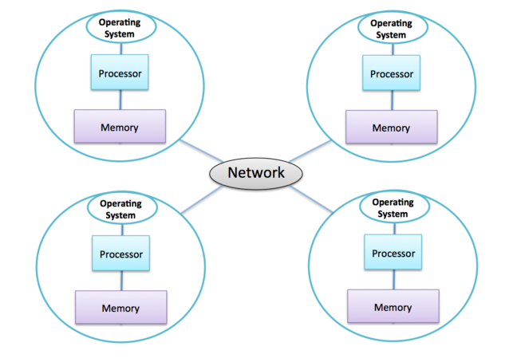

Parallel computing is a type of computing in which the task is divided into several sub-tasks that are independent of each other and can be executed simultaneously. Most of the computing problems are not trivial to parallelize, which means that the sub-tasks need to have access from time to time to some of the results computed by other sub-tasks. The way the sub-tasks exchange the needed information depends on the available hardware.

# Distributed Memory

In practice there are physical limitations to how many CPU cores and how much memory can be fitted on a *die*. This is why all supercomputers use distributed memory architectures in which physical memory and the computing cores are split among various separate computers. 

Each separate computer (usually called a  *node*) operates independently from the others and has its own operating system. The memory is exclusive and the communication is done via a fast network. In the distributed memory model work is divided between sub-tasks, each one with its own memory space. Each task is assigned to a node. If data from another node's memory is needed, explicit communication action needs to be taken. An analogy to this would be a set of workers distributed among several offices, each one with its own whiteboard and communicating with each other via a phone. We can see both advantages and disadvantages to this approach. 

### Advantages
* infinite memory: the number of  whiteboards increases as we add more offices. When a problem is too large, we use more nodes to decrease the amount of memory per node. 
* infinite computing power: the number of workers increases as we add more offices. When a problem is too large, we use more nodes to have less work per node (more parallelism). 
* low cost: it is relatively cheap to increase the memory and and computing capacity of the system by adding more nodes.

### Limitations
* communications can become expensive: following our analogy, the more calls are made between the offices, the more time is spent on sharing data. There is an overhead associated with the communications and in practice there is an upper limit beyond which there is no improvement when tasks or nodes are added. In most such cases the running time increases.
* more complex programming model: the programmer has to split the work evenly between the sub-tasks and decide in which nodes the specific parts of the data reside to achieve a good balance. All communications are explicitly implemented by the programmer. 
