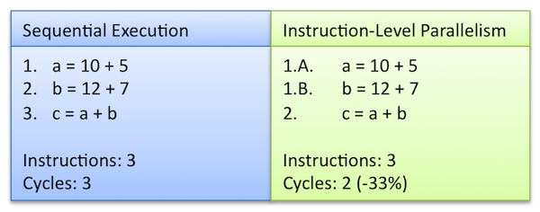

# Types of parallelism
* **Bit-level parallelism**: refers to the parallelism based on increasing the _processor word_ size. For example in the case of a 8-bit processor trying to add 2 16-bit variables would have to divide the operation in two instructions. In the first instruction it would add the 8 lower bits and then in the second one the higher 8 bits. On a 16-bit processor this would be completed using a single instruction. Now all processors use 64 bit words. The programmers have no control at this level, but have to take this into account and choose the appropriate bit size in order to achieve the highest possible performance at the precision required by the specific application. 
* **Instruction-level parallelism (ILP)**: refers to executing simultaneous multiple instructions. For example if the program has to perform sequentially two additions which are independent from each other they can be executed in parallel (see image below). The programmer does not have direct access to the this parallelization, the compiler does the parallelization, however the programmer needs to arrange the code to "help" the compiler detect the parallelizable parts.

<!--- [](https://i.pinimg.com/originals/1f/a4/d7/1fa4d7bda58e84045b9456c391d2aa58.png) --->
* **Vectorization**: refers to parallelism similar to the ILP, in which a specific instruction is applied to multiple data simultaneously. This allows for more efficient parallelization of the code than the ILP. Similarly to the ILP, the programmer has little control over the parallization, however he or she can indicate specific loops to be targeted by the compiler. 
For example, if a programm needs to perform the addition of two vectors element by element we would use a `for` loop in which an addition is performed for each value of `i=0, ...,N-1`:
```C
for(int i=0; i<N; i++)
    c[i]=a]i]+b[i];
```
In the scalar mode the  execution is serial, i.e. first is computed the addition `c[0]=a[0]+b[0]` corresponding to `i=0`, then the addition corresponding to `i=1` and so on, up to `i=N-1`. In the vectorized mode the processor will execute several additions in thee same time. 


* **Core level parallelism**: the same calculation or different calculation is performed to the same data or to different data by a number of cores. The calculations are performed concurrently and often cooperatively. This case can include many parallel modes, multi-threaded with shared memory, multi-processing with distributed memory and as well task parallelism in which each diffferent task runs indipendently of the others.
