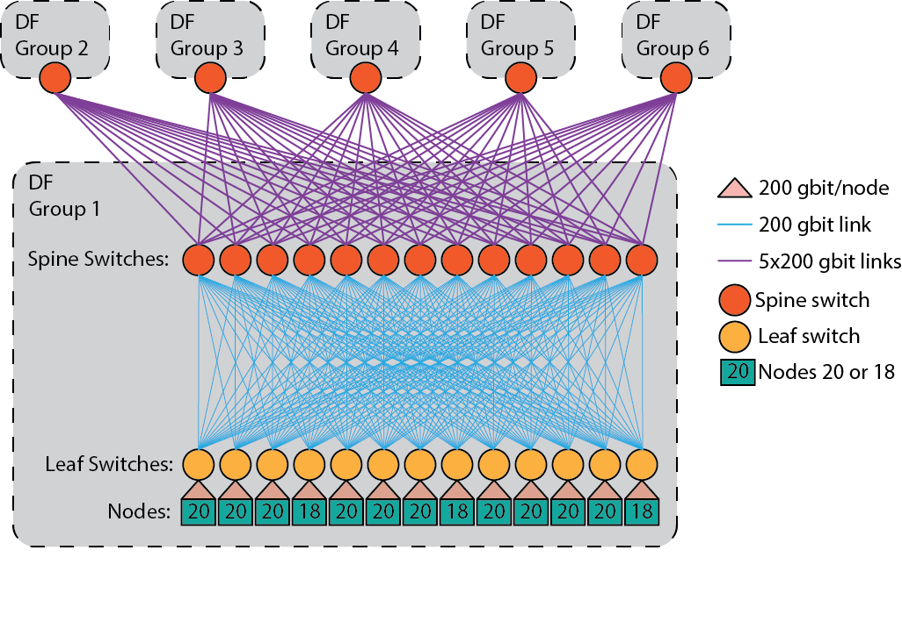

<!-- Includes material from "Supercomputing" online-course (https://www.futurelearn.com/courses/supercomputing/)
by Edinburgh Supercomputing Center (EPCC), licensed under Creative Commons SA-BY -->

# Interconnect

The interconnect network between the nodes is probably the feature that
distinguishes modern supercomputers most from desktop computers. For
trivially parallel problems a special interconnect is not needed, and
enormous computing power can be reached just from computers spread randomly
over the internet. For example, the
[Folding@home](https://foldingathome.org/) project which uses the
personal computers of volunteers all over the world reached a performance of
2,43 exaflops in April 12, 2020.

Many scientific computing problems are, however, more tightly coupled,
and a high-speed interconnect is essential for them.

Two main chracteristics of an interconnect are *latency* and
*bandwidth*:

* Latency is the minimum time it takes to do anything at all,
  i.e. the time it takes to transfer a single byte. You have to pay this
  overhead no matter how much data you are dealing with. For latency,
  smaller is better.

* Bandwidth is the rate at which you transfer large amounts of
  data. For bandwidth, larger is better.

Following our analogy of distributed office workers communicating via phones,
latency would be the time it takes for a caller to dial the number, and
the callee to answer. Bandwidth would be then the speed at which the
caller can speak (and the callee comprehend the information).

As an example about the latency and bandwidth numbers in modern
supercomputers, the interconnect in CSC's Mahti supercomputer has
a latency of about 0,5 microseconds (0,5 x 10-6 or 0,5 millionths of a
second) and the maximum bandwidth between two nodes is 200 Gb/s. The
corresponding numbers for a very high-speed internet connection (on
fiber optic) at home could be a latency of 5 milliseconds (10 000
times more) and a bandwith of 1 Gb/s (200 times less).

To put the latency in a supercomputer interconnect more in perspective,
in 0,5 microseconds light travels 150 m, so if two computers would
be more than 150 m apart, laws of physics would forbid a latency
smaller than 0,5 microseconds. Thus, for problems where low latency is
important, it is clearly not efficient to use a geographically
distributed network of computers.

## Network topology

The way that the connections between the nodes are arranged is called
the *network topology*.

Conceptually the simplest topology is a *fully connected* network,
where there is a direct connection between all pairs of nodes. Even
though a fully connected network would provide the best performance, it
is too complex and costly for anything but very small networks. For example,
with the 1400 nodes of Mahti a fully connected network
would have almost 1 000 000 connections.

The network topologies used in practice try to make a compromise
between the number of connections (and thus price) and the performance that
can be obtained from the topology. Different parallel problems have
different communication characteristics. CPU core in a node might need to
communicate only with a few fixed cores in another node, the other
cores (and nodes) one communicates with can be dynamically changing,
or a core might need to communicate with all the other cores used by
the application. It is very rare that a single application uses the whole
supercomputer, and instead typically the batch job system reserves different
nodes for different runs. For some runs, the nodes can be physically
close to each other, while for other runs they are physically distant. Thus,
there are lots of parameters that need to be considered when choosing
the interconnect topology, and the topologies can be conceptually quite
complex.

For example, the network topology in Mahti is called a Dragonfly topology.
The nodes are divided into six dragonfly groups (with 234 nodes in
each). Within a dragonfly group there is, what is called, a fat tree topology,
and these fat trees between dragonfly groups are then fully connected.

# What is the maximum speed of a supercomputer?

Modern CPU cores perform arithmetic operations extremely fast, and the
main bottleneck is typically how fast we can feed data to the
CPU. Neglecting the disk (which is mostly used at the start and at the
end of the application), the slowest part of the chain feeding data to
the CPUs in a supercomputer is the interconnect.

Even though the latency in Mahti might sound impressive, the CPU cores
running at 2.6 GHz could perform about 20 000 floating point operations in
0,5 microseconds. Communicating 20 000 floating point numbers with 200
Gb/s bandwidth takes about 6.4 microseconds, in which time the CPU
core could perform over 270 000 floating point operations. In this
case, a CPU core could achieve only about 7 % of it's theoretical peak
performance, assuming that all the instruction level parallelism and
vectorization is fully utilized.

In practice the situation is not that bad, as not all the data needs to be
communicated via the interconnect, and in many cases one uses the same
data for several arithmetic operations. Some problems are closer to
the trivially parallel case, and in these cases the main memory within a node
is typically the main bottleneck. The various caches,
algorithmic choices and programming techniques can increase the
achievable performance, *e.g* in some cases it is possible to perform
computation and communication simultaneously.

Different scientific problems have different inherent limits (for
example, how many operations are performed per each memory/interconnect
access, how often data needs to be copied between CPUs and GPUs, etc.), but in
best cases (such as the LINPACK benchmark) it is possible to obtain up to 80 %
of the theoretical peak performance of a supercomputer.
