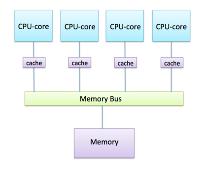
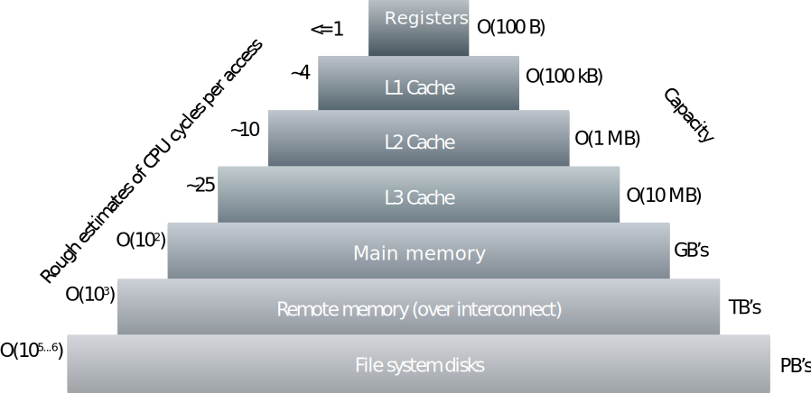

<!-- Includes material from "Supercomputing" online-course (https://www.futurelearn.com/courses/supercomputing/) 
by Edinburgh Supercomputing Center (EPCC), licensed under Creative Commons SA-BY --> 

# Memory hierarchy

So far we have used the term memory when refering to the volatile
storage attached to the CPU, which is shared between the CPU cores
within the supercomputer node. However, in practice there is a
hierarchy of different levels of memory. Sometimes one can include
also the memory of the other nodes (which cannot be directly accesses)
as a part of the hierarchy.

When CPU core calculates `2.1 + 4.3`, it first fetches the two numbers
from the main memory into registers in the CPU core. The result
appears also first in a register, and the value is then pushed from
the register to the main memory. As we have discussed earlier, the
speed of accessing memory can be a performance bottleneck. In order to
alleviate that, modern CPUs (both in desktop and in supercomputers) have memory caches.

## Memory cache

Memory cache is basically a small amount of scratch memory close
to the CPU-core, which is very fast. Basic idea is that when CPU core needs
to load something from the main memory, it first looks in the
cache. If the data is already in the cache, it can be fetched from
cache to register much faster than from the main memory. Also, when a result of
a computation is stored, it is first put from the register into the
cache, and copied to the main memory only later on (e.g. when the
cache becomes full).

Think again of the analogy with workers in an office with
a whiteboard. Whiteboard is the main memory, and workers are now doing their
computations at their desks. Everytime worker reads from or writes to
the whiteboard they need to leave the desk. Imagine now that
each worker has a small notebook: when you need to read data from the
whiteboard, you fill your notebook with everything you need and then
you can work happily at your desk for a longer period of
time. Especially when you do many computations with the same data, the
notebook/cache can speed up the overall memory access a lot.

### Writing data

Cache also works very well for multiple workers if they only ever read data. Unfortunately, real programs also write data, i.e. workers will want to modify the data on the whiteboard. If two people are working on the same data at the same time, we have a problem: if one worker changes some numbers in their notebook then the other worker needs to know about it. The compromise solution is to let everyone know whenever you modify any results in your notebook. Whenever you alter a number, you have to shout out:

\(\) I’ve just changed the entry for the 231st salary - if you have a copy of it then you’ll need to get the new value from me!

Although this is OK for a small number of workers, it clearly has problems when there are lots of workers. Imagine 100 workers: whenever you change a number you have to let 99 other people know about it, which wastes time. Even worse, you have to be continually listening for updates from 99 other workers instead of concentrating on doing your own calculation.

This is the fundamental dilemma: memory access is so slow that we need small, fast caches so we can access data as fast as we can process it. However, whenever we write data there is an overhead which grows with the number of CPU-cores and will eventually make everything slow down again.

Keeping the data consistent and up-to-date on all the CPU-cores is called cache coherency. It means that we always have up-to-date values in our notebook (or, at the very least, that we know when our notebook is out of date and we must return to the whiteboard). Ensuring cache coherency is the major obstacle to building very large multicore processors.

<!-- image copyright EPCC, licensed under Creative Commons SA-BY -->

In order to further improve the memory access, most modern CPUs have
not only one, but multiple levels of cache.

Moving data into and out from the caches is handled by the hardware, and programmer cannot directly control it. However, the way that the data and computations are organized in the program code can have an effect on how efficiently the caches can be utilized.

TODO: better subheader?
## More detailed view on the memory hierarchy

[

The memory levels in the pyramid have the following characteristics: 
* Physical location: The higher in the pyramid, physically closer to
  the CPU core the memory is.
* Performance: As we move from the bottom of the pyramid to the top, transfer speed (MB/s) increases.
* Access time: The time between read/write requests decreases as we move up in the hierarchy.
* Capacity: The amount of information that the memory type can store increases towards the bottom.
* Cost per byte: The higher in the pyramid, the more costly the
  memory is. The physical memory is more expensive than the disk.

### Types of memory:

*  **Registers** are the fastest type of memory. All the arithmetic operations are done on the data in registers. CPUs have general-purpose registers, as well as registers for specific type of data, or for specific operations. Physically, registers are a part of the CPU core.
*  **L1, L2, L3 caches** are intermediate caches between the main memory and the registers. L1 cache is the smallest and fastest, while L3 is the largest and slowest. When CPU core needs to fetch data, it looks first in the L1, then L2, and finally L3, before fetching from the main memory. Often, each core has their own L1 and L2 caches, but L3 cache might be shared between some cores. As an example, the AMD Rome 64 core processors in CSC's Mahti supercomputer have the following charecteristics:
   * L1 cache: 32 KiB (+ 32 KiB for instructions), private to the core.
   * L2 cache: 512 KiB, private to the core.
   * L3 cache: 16 MiB, shared between 4 cores.
*  **Main memory** is the the memory within a node, where all instructions and data of active programs reside. 
*  **Remote memory** 
*  **Disks** can store the data also after the program has ended or computer shutwod, unlike all the other type of memory.

