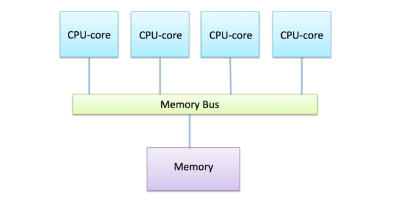

<!--NOTE: This version of article is not for Elements of HPC, but is retained for possible 
utilization in other omore technical contexts -->

Parallel computing is a type of computing in which the task is divided in several subtasks that are independent of each other and can be executed simultaneously. Most of computing problems are not trivially parallelizable, which means that the subtasks need to have access from time to time to some of the results computed by other subtasks. The way subtasks exchange needed information depends on the available hardware. 

# Shared memory 

Shared memory refers to a physical memory device which can be accessed by more than one computing core.

Shared memory (SM) can be e.g. the CPU cache shared by all cores in the same CPU and the computer main memory shared by all cores on the same motherboard or node. (In the case of GPU, "shared memory" is used to refer to the local memory available on each SM. The threads in a block can access and share data with each other.) Personal computers and mobile phones are all based on shared-memory architectures. The connection between various cores and memory is done via a **memory** *bus* that takes all requests from each core and fetches or writes the data in the memory. 

Programmatically, shared memory can be seen as a space in the memory allocated to a program which can be accessed by a group of threads working together, without additional communication. All threads in a group can write and read from a given location in the memory. A good analogy for the shared memory programming model is an office where several workers work together to solve a problem. Taking this analogy further, communication between the workers is done via a whiteboard which can be read or written only by going near it. In this analogy, we can already see the advantages and limitations of this kind of approach.

### Advantages

There are several advantages for using shared memory:
* Good performance: the workers do the work and put the results on the whiteboard which is close to all of them. Because all data is global, there is no time lost in communication between the different threads and workers.
* Simple programming model: shared memory programming is supported by all high-level programming languages and the codes can be used without changes on different multi-core processors.

### Limitations

There are also limitations to using shared-memory architectures. 
* Memory capacity: Only a limited number of workers can fit in an office. The size of the problem to be solved is limited by the available memory. If the problem is too big for the device, the only solution is to switch to another device with more memory. Developing devices with a larger memory capacity is very costly. 
* Memory access speed: There is a limitation to how many workers can read and write the whiteboard. It is easy to fill up the **memory** *bus*, which results in the computing cores waiting and not being utilized at maximum capacity. In some applications, it can be faster to use only some of the available cores.
* Race conditions and locks: The memory can be accessed by all threads at any time, which means the programmer has to make sure the data is written by a specific thread before it is used or read by another thread. The synchronization needed to avoid the race conditions can result in deadlocks if done incorrectly.
