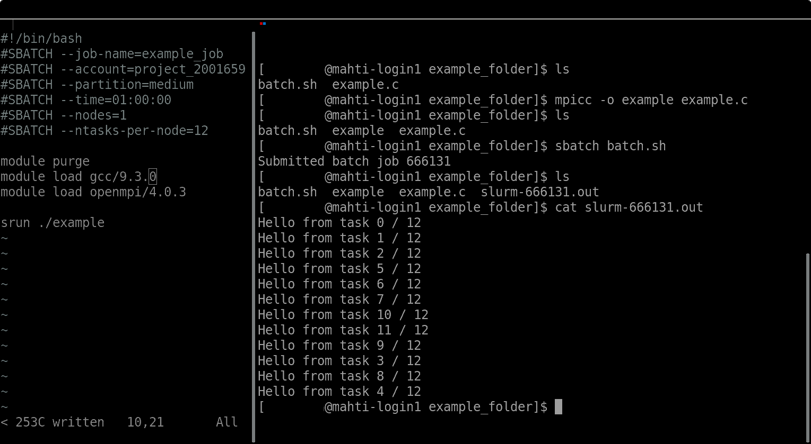

## How users access supercomputers and run jobs

In contrast to the familiar situation where a user runs e.g. Word on
his or her personal laptop, a supercomputer may serve hundreds or
thousands of users (as an example, CSC has currently over two thousand
users) who connect to the system through the internet. Also, 
where most laptop users utilize a graphical user interface (*i.e*
start applications by double-clicking with a mouse and generally use a
mouse extensively), the most common way to use supercomputers is via
command line. So, instead of using a mouse, one works by typing commands
with a keyboard. Even though the command line interface might at first
feel arcane to someone who has only used graphical desktop
applications, the command line is a very powerful and flexible way to use
the computer. After all, supercomputers are to normal computers what a
formula 1 car is to a common stationwagon, great power may come with
more difficult usage. However, where very few people have a chance to
even try to learn how to drive formula 1, any body can learn the
basics of using supercomputers via command line in one day.

*Example of a terminal with two spereate instances   Left: Batch file ; Rigth: Batch job submission*

Supercomputers are not made more difficult to use on purpose, and
supercomputing centers are constantly looking for ways to make
supercomputers more accessible. Nowadays, some supercomputing centers
provide also web browser based access, which allows users to utilize
supercomputers with more graphical interfaces via web browser (Firefox,
Chrome, Safari, Edge, ...) running on their local laptop or desktop computer.

As a supercomputer may have thousands of users, there are not
necessarily enough resources (e.g. CPUs, GPUs and memory) for every one to run
their jobs at the same time. Thus, users typically cannot run their
heavy computations directly whenever they want (this would be called
*interactive use*) but have to submit their jobs through a *batch
queueing system*. The batch system then takes care of scheduling distribution of the
resources in a fair way. If the supercomputer has enough free
resources, the job can start immediately, otherwise it may take hours
or sometimes even days for the job to start. Batch system ensures also
that single users cannot monopolize the system, there are typically
limits on how much resources a single user can utilize at the
time. Batch system makes the utilization of supercomputer more
efficient. With only interactive use there would be load mainly during normal
working hours, but with the help of a batch system jobs can be run on
supercomputer 24/7 throught the whole year.

TODO (Edukamu team/CSC): Could the batch system basic principle be presented as a figure?
Examples: https://www.researchgate.net/figure/Schematic-view-of-the-supercomputer-at-Cornell-University-with-cluster-controller-batch_fig1_277295561
https://confluence.ecmwf.int/display/UDOC/Batch+Systems?preview=/47294624/47613083/batch-schema.png
https://hbp-hpc-platform.fz-juelich.de/?page_id=732

When using the batch system, the user describes to the system (in most
cases in a special file called a *batch script*) which executable is
to be run, how many nodes, cores, possibly GPUs, how much memory
is to be used, and finally, how much time is to be reserved for the
job. The batch queueing system then uses a complicated algorithm to
decide when and in which subset of the nodes the job will be run. 
Typically, the more nodes and other resources and/or time a job
requires, the longer it must wait in queue to wait for its turn to be
executed. 

Link to additional material: [Using command line in CSC supercomputers](https://docs.csc.fi/support/tutorials/env-guide/overview/)

## Who can use supercomputer?

Most supercomputing centers all over the world have a similar policy for
accessing supercomputers. Supercomputing centers typically have
public national funding, and people performing academic research
within the country hosting the supercomputers can use them for
free. As an example, CSC provides free access to researchers (and
sometimes also for students) with an affiliation to a Finnish higher
education institution (Universities, Universities of Applied
Sciences), or a state research institute, for research where results
are made publicly available. Supercomputers are typically available
also for commercial usage, however, commercial usage is normally
separately invoiced. 

Many supercomputing centers participate in transnational access
programs where also users outside the hosting country are provided
resources in the supercomputer based on special applications (and
possibly with scientific criteria for approving applications). 

The forthcoming LUMI supercomputer is funded by a consortium of ten
European countries (Finland, Belgium, the Czech Republic, Denmark,
Estonia, Iceland, Norway, Poland, Sweden, and Switzerland) and
European Union. Half of the resources of LUMI is allocated to
consortium members, other half is available also for researchers and
industries outside the consortium via a special application process.
