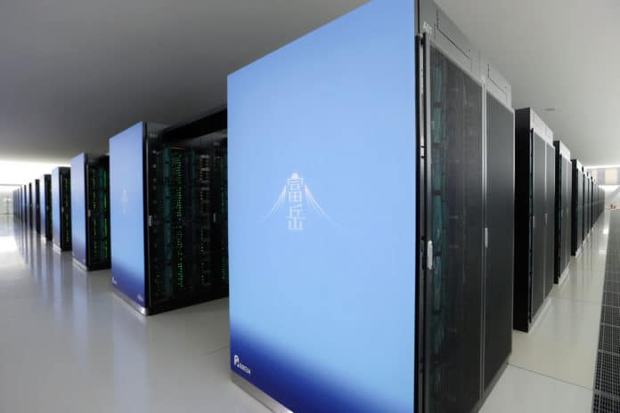
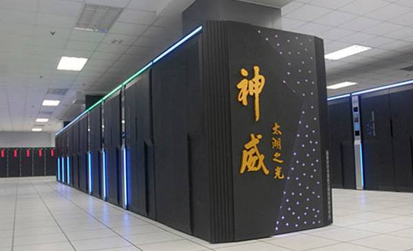

# Examples of top supercomputers

How do the top supercomputers of the world look like in more detail? Let's
have a brief look at some of the most powerful systems in the world.

## Fugaku, Japan

Fugaku is currently (as of June 2020) the most powerful computer in the world,
with theoretical peak performance of 514 PFlop/s. Fugaku is hosted by
RIKEN Center for Computational Science in Kobe, Japan, and the system is
manufactured by Fujitsu. Fukagu is a bit of an exception in the top 10 as it
uses ARM A64FX processors. Each processor has 48 computational cores running
with a clock frequency of 2,2 GHz. Each node contains a single CPU and
additional asssistant cores (2 in computational nodes and 4 in I/O nodes), and
in total, there are 7 299 072 cores in the system. The total amount of memory
is 4 866 048 gigabytes. The declared power consumption is 28 MW. 
For a bit of perspective, the average sauna is estimated to have a power consumption of around 9 KW. 
The equivalent of Fugakus power consumption is approximately 3100 saunas.

COMMENT: Tehonkulutuksen vertailukohtana voisi käyttää tavanomaista saunan kiuasta, jonka teho on 9 KW. Tällä saisimme havainnollistettua mittakaavaa: 28 MW vastaa noin 3100 saunan kiuasta.

## Summit, USA

Summit is hosted by Oak Ridge National Laboratory, USA, and it is a prime
example of a modern-day accelerated supercomputer based on GPUs. Summit has in total 4608
nodes, and each node contains two IBM POWER9 processors and six NVIDIA Volta
V100 GPUs. The theoretical peak performance of the system is 201 PFlop/s. The
total amount of memory is over 10 000 000 gigabytes. The declared power consumption is 10 MW.
Yet again, that is aorund 1100 saunas of power draw. 

## Sunway TaihuLight, China

The Chinese Sunway TaihuLight was the world's fastest supercomputer for two years in
2016–2017, and it is still (in June 2020) number four on the list with a
theoretical peak performance of 125 PFlop/s. The system uses Chinese-designed
multicore processors, where individual CPU cores are not very fast, running
only at 1,45 GHz, but each CPU contains 256 cores. In total, there are over 10
000 000 cores in the system and over 1 000 000 gigabytes of memory. The system
runs its own Linux-based operating system, and the programming environment is
also heavily customized in order to support the Sunway CPU architecture. 
The declared power consumption is 15 MW. This time we're looking at around 1600 saunaus drawing power simultaneously.
